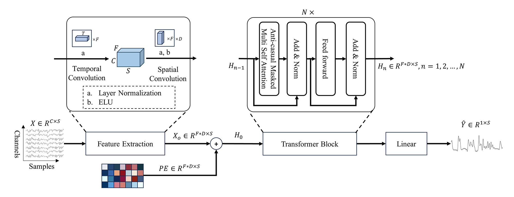
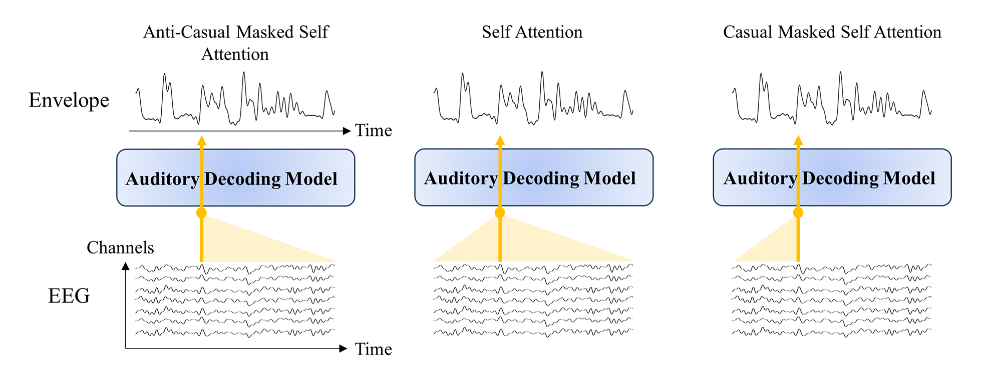
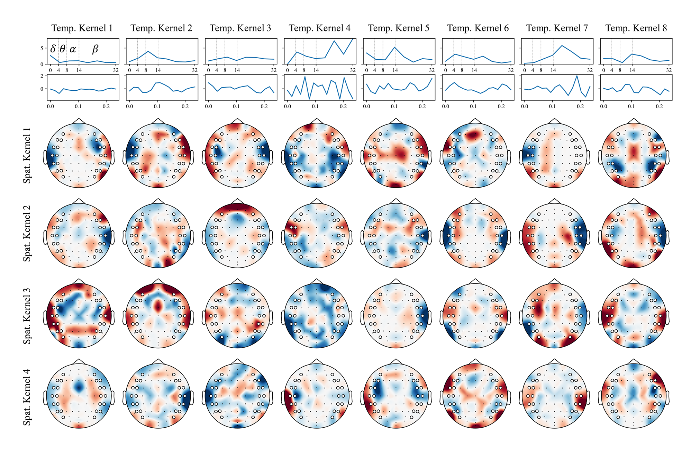

# ADT Network: A Novel Nonlinear Method for Decoding Speech Envelopes from EEG Signals

We introduce here ADT Network, a new nonlinear method for decoding speech envelopes from electroencephalogram (EEG) signals. ADT Network is a deep learning-based method that can decode speech envelopes by learning a nonlinear mapping between EEG signals and speech envelopes. Our experimental results show that ADT Network has high accuracy in decoding speech envelopes and has better performance than existing methods.  

## Architecture
The architecture of ADT Network consists of spatio-temporal convolution and inverse causal Transformer decoder. Spatio-temporal convolution is used to extract the features of the EEG signal and the inverse causal Transformer decoder is used to learn the nonlinear mapping between the EEG features and the speech envelope.The architecture of ADT Network is shown in the following figure:  

## Why Anti-Causal Transformer Decoder?
To faithfully replicate the anti-causal dynamics of speech envelope reconstruction from EEG signals, we integrate an anti-causal masking strategy within the self-attention mechanism of our Transformer model. This meticulously crafted masking design ensures that, during signal processing at any given moment, the model is restricted to harnessing information from concurrent and future data points exclusively, effectively sidelining antecedent signal details. This methodology adeptly echoes the inherent causal sequence from audio stimuli to brain responses, as illustrated in Figure 2, compelling the model to emulate physiological processes in a reversed manner by depending solely on subsequent EEG signals for speech signals reconstruction. By adopting this technique, our model achieves heightened precision in predicting and restoring speech envelopes from EEG inputs, aligning seamlessly with the intrinsic logic and physiological underpinnings governing speech information decoding from EEG signals.  

## Visualization of the weights of Spatio-Temporal Convolution Layer
We visualize the weights of the spatio-temporal convolution layer in ADT Network. The visualization results are shown in Figure 3. The weights of the spatio-temporal convolution layer capture the spatial and temporal patterns of EEG signals, which are essential for understanding the behavior of the network.  

## Acknowledgements
Part of the code was obtained and improved from the auditory EEG challenge, with thanks to the ExpORL team from KU Leuven!
